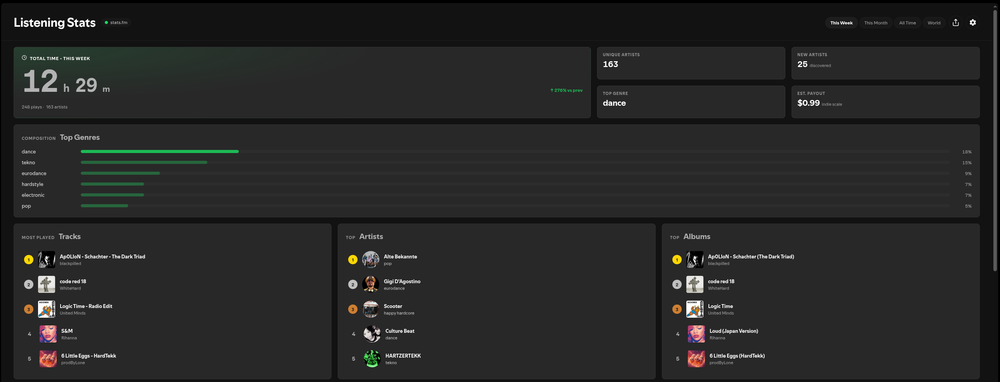
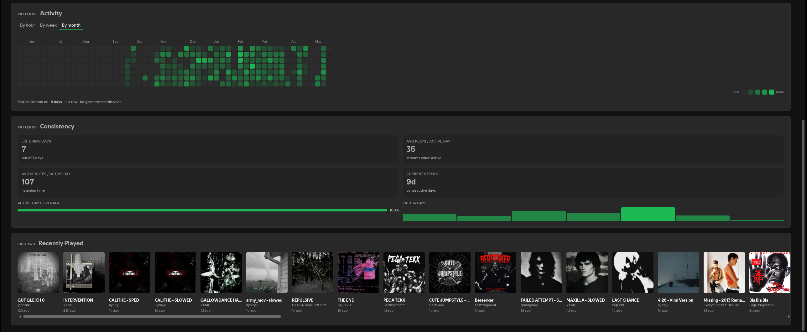

# Listening Stats

Spicetify custom app: a listening statistics dashboard inside Spotify (stats.fm, Last.fm, or local tracking).



  

## Features

- **Providers:** stats.fm (recommended), Last.fm, or **local** on-device history
- **Top lists:** tracks, artists, albums, genres (counts or listening time)
- **Activity:** hourly patterns, weekday views, calendar heatmap (where supported)
- **Share cards:** story and landscape images from your stats
- **Dashboard:** drag-and-drop sections, visibility toggles, Spicetify theme variables
- **Export:** JSON / CSV where applicable
- **Privacy:** data stays local; API calls only to providers you configure

End-user guides and troubleshooting: **[Wiki](https://github.com/Xndr2/listening-stats/wiki)**.

## Requirements

- Spotify desktop client
- If Spicetify is **not** installed yet, the one-liner below installs the **Spicetify CLI** for you (then installs Listening Stats).  
  - **macOS / Linux:** installs to `~/.spicetify` (needs `curl`, `tar`, `grep`; do **not** run the installer with `sudo`).  
  - **Windows:** installs under `%LOCALAPPDATA%\spicetify` (use a **non-admin** PowerShell window).  
- If Spicetify is **already** on your `PATH`, the script skips CLI install and only downloads Listening Stats.

## Installation

**Linux / macOS**

```bash
curl -fsSL https://raw.githubusercontent.com/Xndr2/listening-stats/main/install.sh | bash
```

**Windows (PowerShell)**

```powershell
irm https://raw.githubusercontent.com/Xndr2/listening-stats/main/install.ps1 | iex
```

This does **not** install the Spicetify Marketplace (optional). You can add it later from [Spicetify docs](https://spicetify.app/docs/getting-started) if you want.

**Manual:** grab **`listening-stats.zip`** from [Releases](https://github.com/Xndr2/listening-stats/releases), extract so you have `CustomApps/listening-stats/` containing `manifest.json`, `index.js`, and `extension.js`, then:

```bash
spicetify config custom_apps listening-stats && spicetify apply
```

## Releases

- **Version source:** `package.json` drives the in-app version and release tooling.
- **GitHub Releases:** CI attaches `listening-stats.zip` on publish; Marketplace/metadata details live in **`docs/DEVELOPMENT.md`** for maintainers.

## Contributing

Feedback and bug reports are welcome. There is an active dev channel on Discord: **[invite](https://discord.gg/XtqbFAHk6a)**.

1. Fork the repository  
2. Branch: `git checkout -b feature/your-feature`  
3. Run **`pnpm test`**, **`pnpm lint`**, and a production **`pnpm build`** before opening a PR  
4. Open a pull request against **`main`**

## License

MIT
